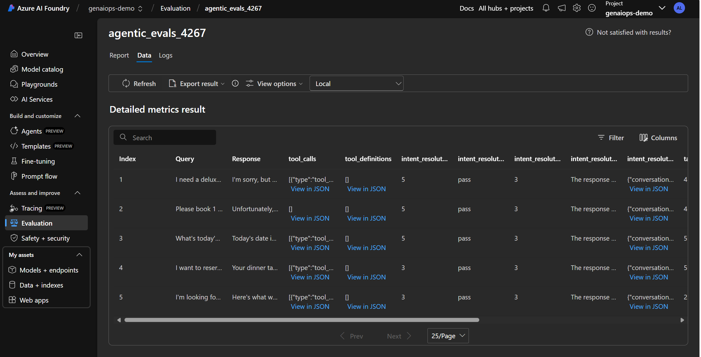

# AgenticEvals

AgenticEvals is a simple agentic AI system designed for generating and evaluating small datasets. The system leverages an automated approach to generate an evaluation dataset file, which is then used to assess your app using three key agentic AI evaluation metrics:

- **tool_call_accuracy**: Measures how accurately the AI system calls tools and handles their responses.
- **intent_resolution**: Evaluates the system’s ability to understand and resolve user intentions.
- **task_adherence**: Checks how closely the system follows the defined tasks and expected outcomes.

## Overview

This repository demonstrates an agentic AI approach where the system autonomously generates an evaluation dataset and uses this dataset to run a series of evaluation methods on the app. These evaluations help understand the effectiveness of the AI in handling tool calls, resolving intents, and adhering to tasks.

## Features

- **Automated Dataset Generation:** Quickly generate a tailored evaluation dataset.
- **Evaluation Metrics:** 
  - **Tool Call Accuracy**
  - **Intent Resolution**
  - **Task Adherence**
- **Modular Design:** Easily extend the evaluation methods or integrate the system with other projects.

## Getting Started

### Provision resources

1. **Deploy CosmosDB**
    -  As the agent interacts with data stored in a database, you'll need to deploy a CosmosDB resource, create a database and provision data in it. 
    
    *Pre-requisites*: 
    - You'll need to have an existing Azure CosmosDB for NoSQL Serverless resource created;
    - Once the resource is created, you need to enable both **Full-Text & Hybrid Search for NoSQL API** and **Vector Search for NoSQL API** features.

    Run the following command to provision the database: 
    ```
    .\utils\seed_cosmosdb.py
    ```

### Installation

1. **Clone the Repository:**

   ```
   bash
   git clone https://github.com/alevretmicrosoft/AgenticEvals.git
   cd AgenticEvals
   ```

2. **Install dependencies:**

   ```
   python -m venv .venv
   .\.venv\Scripts\activate
   pip install -r requirements.txt
   ```
3. **Specify environment variables**
    - Rename the ```.env.sample``` file and update with your variables.

4. **Test the app**
    ```
    py main.py
    ```

5. **Generate an evaluation dataset**
    ```
    py generate_evaluation_data.py
    ```

6. **Evaluate the Agentic AI system**
    ```
    py .\evals\evaluate_agentic_app.ipynb
    ```

## Results

The last script intends to use the Azure AI Evaluation library to evaluate performance of the system through purpose built-in agentic metrics such as **Task adherence**, **Tool accuracy** and **Intent resolution**.

It exports the result to the Azure AI Foundry project specified in your ```.env``` file which offers an Evaluation UI experience (see image below).


